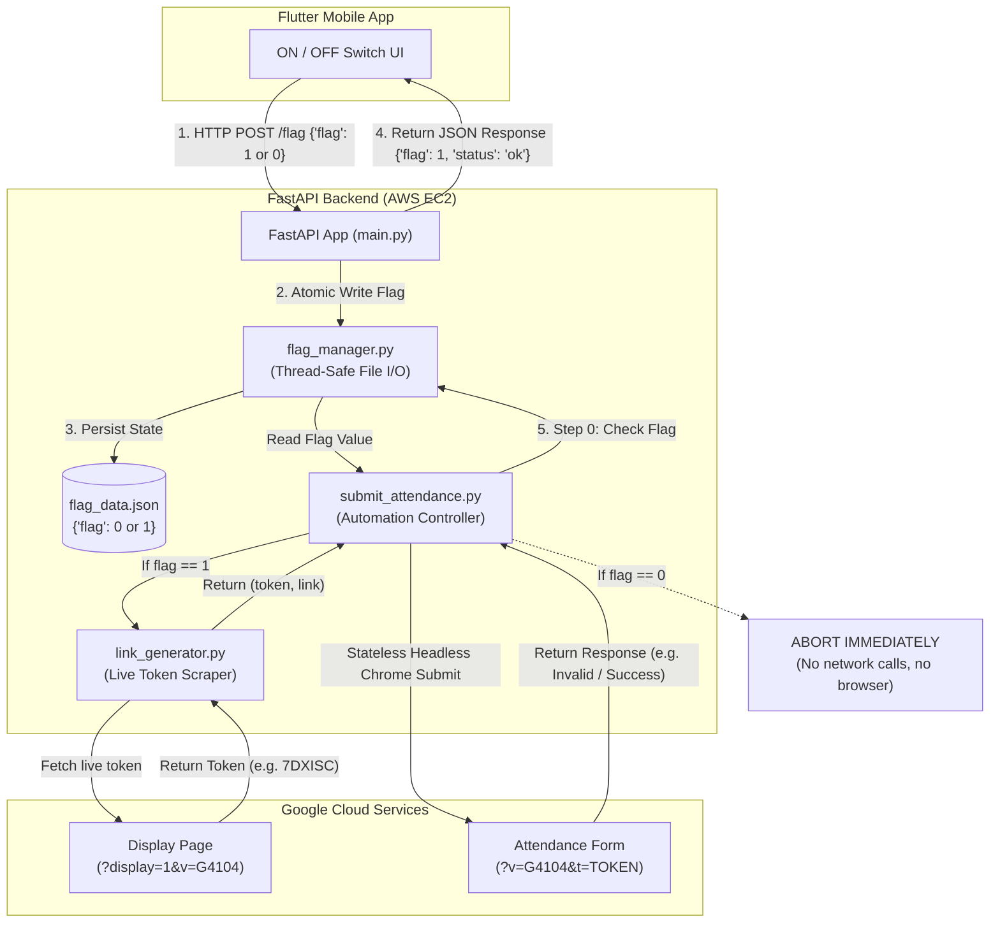

# 📘 Attendance Automation Backend - System Architecture & API Documentation (`idea.md`)

This document provides a comprehensive technical overview of the backend system hosted on an **AWS EC2 instance**, interfacing with a **Flutter Frontend application**, and executing the attendance automation pipeline.

---

## 📑 Table of Contents
1. [System Architecture & Flow](#1-system-architecture--flow)
2. [File Directory & Structure](#2-file-directory--structure)
3. [File Definitions & Responsibilities](#3-file-definitions--responsibilities)
4. [API Specification (Request & Response)](#4-api-specification-request--response)
5. [Flag Guard Execution Logic](#5-flag-guard-execution-logic)
6. [How to Start & Manage the Server](#6-how-to-start--manage-the-server)
7. [Frontend (Flutter) Integration Guide](#7-frontend-flutter-integration-guide)

---

## 1. System Architecture & Flow

The system acts as a bridge between the user's mobile device (Flutter app) and the Google Apps Script attendance system.



---

## 2. File Directory & Structure

Located in: `D:\Ai_space\cloud\`

```text
cloud/
├── main.py                   # FastAPI application & REST API routing
├── flag_manager.py           # Thread-safe atomic reader & writer for flag_data.json
├── flag_data.json            # Persistent JSON state file (holds flag: 0 or 1)
├── link_generator.py         # HTTP token scraper and link constructor
├── submit_attendance.py      # Attendance submitter with pre-flight flag validation
├── requirements.txt          # Production dependencies
├── start_server.sh           # Linux / AWS EC2 server start script
├── start_server.bat          # Windows local development start script
├── attendance.service        # systemd background service configuration for EC2
├── test_backend.py           # Unit and integration test suite
├── EC2_DEPLOYMENT_GUIDE.md   # Step-by-step AWS EC2 deployment guide
└── idea.md                   # This architecture & API document
```

---

## 3. File Definitions & Responsibilities

### 1. `main.py`
* **Role**: Primary API server using **FastAPI** and **Uvicorn**.
* **Key Duties**:
  * Exposes HTTP endpoints for the Flutter application (`/flag`, `/status`, `/on`, `/off`, `/submit`).
  * Provides full CORS support (`CORSMiddleware`) for unrestricted cross-origin requests from Flutter mobile and web.
  * Connects API calls to `flag_manager.py` to persist flag states.
  * Launches background submission tasks when requested.

### 2. `flag_manager.py`
* **Role**: Centralized data access layer for `flag_data.json`.
* **Key Duties**:
  * Implements `get_flag() -> int`: Reads the flag safely (returns `0` if file is missing/empty).
  * Implements `set_flag(value: int) -> int`: Thread-safe, atomic disk write using mutex locks and temporary file replacement to prevent file corruption.

### 3. `flag_data.json`
* **Role**: State persistence file.
* **Format**:
  ```json
  {
    "flag": 0,
    "updated_at": "2026-09-13T23:14:00Z"
  }
  ```

### 4. `link_generator.py`
* **Role**: Lightweight token and URL generator.
* **Key Duties**:
  * Uses fast, pure HTTP requests via `requests` (executes in $< 1$ second).
  * Extracts the live 60-second rotating alphanumeric token from the venue display page (`?display=1&v=G4104`).
  * Returns the full parameterized URL: `https://script.google.com/.../exec?v=G4104&t=TOKEN`.

### 5. `submit_attendance.py`
* **Role**: Browser automation pipeline with pre-flight flag gating.
* **Key Duties**:
  * **Flag Guard (Step 0)**: Checks `get_flag()`. If `flag == 0`, immediately aborts. It will **never** call `link_generator.py` or launch Chrome.
  * **Stateless Chrome**: Runs in-memory headless Chromium (`--headless=new`, `--no-sandbox`, `--disable-dev-shm-usage`, `--disable-gpu`) with zero disk footprint or cookies.
  * **Submission & Evaluation**:
    * **True State 1**: `"Attendance successfully recorded for"` $\rightarrow$ SUCCESS (Exit 0).
    * **True State 2**: `"Attendance already recorded"` $\rightarrow$ SUCCESS (Exit 0).
    * **False State 1**: `"QR Code Expired. Please scan latest QR"` $\rightarrow$ Restarts from `link_generator.py`.
    * **False State 2**: Any other unexpected error $\rightarrow$ Restarts from `link_generator.py`.

---

## 4. API Specification (Request & Response)

### Base URL:
`http://<YOUR_EC2_PUBLIC_IP>:8000`

---

### Endpoint 1: Toggle Flag (Primary Endpoint for Flutter)

#### `POST /flag`
Changes the backend state to ON (`flag=1`) or OFF (`flag=0`).

* **Request Headers**:
  ```http
  Content-Type: application/json
  ```
* **Request Body (Turn ON)**:
  ```json
  {
    "flag": 1
  }
  ```
* **Response (HTTP 200 OK)**:
  ```json
  {
    "flag": 1,
    "status": "ok"
  }
  ```

* **Request Body (Turn OFF)**:
  ```json
  {
    "flag": 0
  }
  ```
* **Response (HTTP 200 OK)**:
  ```json
  {
    "flag": 0,
    "status": "ok"
  }
  ```

---

### Endpoint 2: Get Current Status

#### `GET /status` (or `GET /flag`)
Used by Flutter on app launch to synchronize the UI toggle button with the actual server state.

* **Request Headers**: _None_
* **Request Body**: _None_
* **Response (HTTP 200 OK)**:
  ```json
  {
    "flag": 0,
    "status": "ok"
  }
  ```

---

### Endpoint 3: Toggle via Query Parameter (Alternative)

#### `GET /flag?flag=1` or `POST /flag?flag=0`
* **Response (HTTP 200 OK)**:
  ```json
  {
    "flag": 1,
    "status": "ok"
  }
  ```

---

### Endpoint 4: Shortcut Endpoints

#### `POST /on`
* **Response**: `{"flag": 1, "status": "ok"}`

#### `POST /off`
* **Response**: `{"flag": 0, "status": "ok"}`

---

## 5. Flag Guard Execution Logic

```text
User Action (Flutter)          Backend (FastAPI)              Automation Engine
───────────────────────────────────────────────────────────────────────────────
Taps "OFF" (flag=0)   ───>   Updates flag_data.json (0)
                             Returns: {flag:0, status:'ok'}
                                                              submit_attendance.py executes
                                                                    │
                                                                    ▼
                                                              [Check Flag]
                                                                    │
                                                                    ├──> flag == 0?
                                                                    │         │
                                                                    │         ▼
                                                                    │    ABORT IMMEDIATELY
                                                                    │    (No link_generator,
                                                                    │     No Chrome browser)
                                                                    │
Taps "ON" (flag=1)    ───>   Updates flag_data.json (1)             │
                             Returns: {flag:1, status:'ok'}         │
                                                                    ├──> flag == 1?
                                                                              │
                                                                              ▼
                                                                        PROCEED TO STEP 1
                                                                        (link_generator.py)
                                                                              │
                                                                              ▼
                                                                        PROCEED TO STEP 2
                                                                        (submit_attendance.py)
```

---

## 6. How to Start & Manage the Server

### Option A: Local Testing (Windows)
Run the batch script:
```cmd
cd D:\Ai_space\cloud
start_server.bat
```
Or directly with Python:
```cmd
python -m uvicorn main:app --host 0.0.0.0 --port 8000 --reload
```

---

### Option B: AWS EC2 (Linux / Ubuntu)

1. **Start Manually**:
   ```bash
   cd /home/ubuntu/cloud
   bash start_server.sh
   ```

2. **Start as a 24/7 Background System Service (`systemd`)**:
   ```bash
   # Copy service file
   sudo cp /home/ubuntu/cloud/attendance.service /etc/systemd/system/

   # Reload system daemon and start
   sudo systemctl daemon-reload
   sudo systemctl enable attendance.service
   sudo systemctl start attendance.service

   # Check status
   sudo systemctl status attendance.service

   # View live logs
   sudo journalctl -u attendance.service -f
   ```

---

## 7. Frontend (Flutter) Integration Guide

Add `http` to your `pubspec.yaml`:
```yaml
dependencies:
  flutter:
    sdk: flutter
  http: ^1.2.0
```

### Complete Flutter Dart Service Class

```dart
import 'dart:convert';
import 'package:http/http.dart' as http;

class BackendService {
  // Replace with your actual EC2 Public IPv4 address
  static const String baseUrl = 'http://13.233.xxx.xxx:8000';

  /// Sends toggle command: flag = 1 (ON) or flag = 0 (OFF)
  static Future<bool> setFlag(int flagValue) async {
    final uri = Uri.parse('$baseUrl/flag');
    try {
      final response = await http.post(
        uri,
        headers: {'Content-Type': 'application/json'},
        body: jsonEncode({'flag': flagValue}),
      );

      if (response.statusCode == 200) {
        final data = jsonDecode(response.body);
        print('Backend Response: $data'); // Output: {"flag": 1, "status": "ok"}
        return data['status'] == 'ok';
      } else {
        print('Server returned error status: ${response.statusCode}');
      }
    } catch (e) {
      print('Network exception: $e');
    }
    return false;
  }

  /// Fetches current flag status from backend on app launch
  static Future<int> getFlagStatus() async {
    final uri = Uri.parse('$baseUrl/status');
    try {
      final response = await http.get(uri);
      if (response.statusCode == 200) {
        final data = jsonDecode(response.body);
        return data['flag'] ?? 0;
      }
    } catch (e) {
      print('Failed to get status: $e');
    }
    return 0; // Default to OFF if server is unreachable
  }
}
```

### Usage in Flutter Toggle Button Widget
```dart
bool isAttendanceOn = false;

@override
void initState() {
  super.initState();
  // Fetch initial status from EC2
  BackendService.getFlagStatus().then((status) {
    setState(() {
      isAttendanceOn = (status == 1);
    });
  });
}

void onToggleChanged(bool value) async {
  int targetFlag = value ? 1 : 0;
  bool success = await BackendService.setFlag(targetFlag);

  if (success) {
    setState(() {
      isAttendanceOn = value;
    });
  }
}
```
