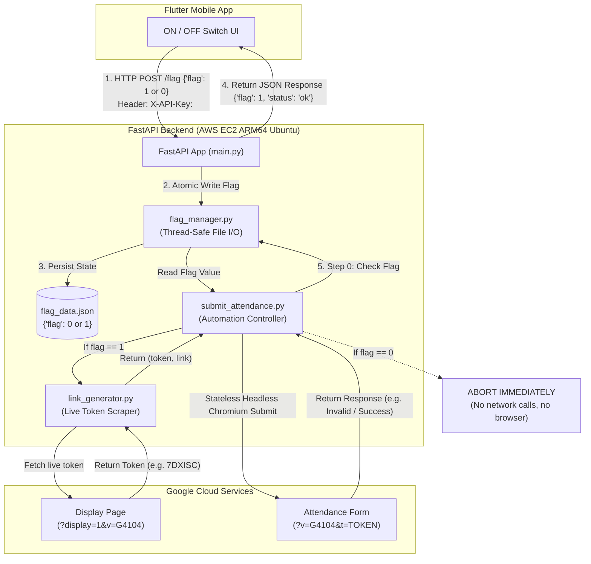

# 📘 Attendance Automation Backend - System Architecture & API Documentation (`idea.md`)

This document provides a comprehensive technical overview of the backend system hosted on an **AWS EC2 ARM64 instance** (Ubuntu Server on `t4g.small` in `ap-south-1` with IPv6 connectivity), interfacing with a **Flutter Frontend application**, and executing the attendance automation pipeline.

---

## 📑 Table of Contents
1. [System Architecture & Flow](#1-system-architecture--flow)
2. [Production Environment Specifications](#2-production-environment-specifications)
3. [File Directory & Structure](#3-file-directory--structure)
4. [File Definitions & Responsibilities](#4-file-definitions--responsibilities)
5. [API Specification (Request & Response)](#5-api-specification-request--response)
6. [Flag Guard Execution Logic](#6-flag-guard-execution-logic)
7. [How to Start & Manage the Server](#7-how-to-start--manage-the-server)
8. [Frontend (Flutter) Integration Guide](#8-frontend-flutter-integration-guide)

---

## 1. System Architecture & Flow

The system acts as a secure cloud bridge between the user's mobile device (Flutter app) and the Google Apps Script attendance system.



---

## 2. Production Environment Specifications

* **AWS Instance**: `t4g.small` (ARM64 / Graviton2, 2 vCPUs, 2 GiB RAM, 8 GiB gp3 EBS)
* **Region**: `ap-south-1` (Mumbai)
* **OS**: Ubuntu Server 22.04 / 24.04 LTS (aarch64)
* **Networking**: Public IPv6 default route with IPv6 listening on `[::]:8000`
* **Browser Runtime**: Native Ubuntu ARM64 `chromium` package (no AMD64 binaries)
* **Process Model**: Single Uvicorn worker process to conserve RAM and enforce process-level concurrency locking

---

## 3. File Directory & Structure

Located in: `D:\Ai_space\cloud\`

```text
cloud/
├── main.py                   # FastAPI application & REST API routing with X-API-Key auth
├── flag_manager.py           # Thread-safe atomic reader & writer for flag_data.json
├── flag_data.json            # Persistent JSON state file (holds flag: 0 or 1)
├── link_generator.py         # HTTP token scraper and link constructor (ATTENDANCE_VENUE configurable)
├── submit_attendance.py      # Attendance submitter with pre-flight flag validation & stateless Chromium
├── reset_flag.py             # Dedicated CLI utility to reset flag to 0 (OFF)
├── requirements.txt          # Minimal production dependencies
├── start_server.sh           # Linux / AWS EC2 server start script (binds to [::]:8000)
├── start_server.bat          # Windows local development start script
├── attendance.service        # systemd background service configuration for EC2 (1 worker, IPv6)
├── test_backend.py           # Comprehensive unit and integration test suite
├── .env.example              # Safe template configuration for environment variables
├── .gitignore                # Protects secrets (.env), caches, logs, and temp files from Git
├── EC2_DEPLOYMENT_GUIDE.md   # Step-by-step ARM64 EC2 deployment & IPv6 setup guide
└── idea.md                   # This architecture & API document
```

---

## 4. File Definitions & Responsibilities

### 1. `main.py`
* **Role**: Primary API server using **FastAPI** and **Uvicorn**.
* **Key Duties**:
  * Exposes secure HTTP endpoints for the Flutter application (`/flag`, `/status`, `/on`, `/off`, `/submit`, `/health`).
  * Enforces **Header-only API key authentication** (`X-API-Key`) with constant-time verification (`secrets.compare_digest`).
  * Provides a public health check at `GET /health` (`{"status": "ok"}`) and root service identification at `GET /`.
  * Enforces strict validation on flag values: ONLY `Literal[0, 1]` is accepted.
  * Implements read-only semantics for `GET /flag`.
  * Manages an in-process concurrency guard (`threading.Lock`) preventing simultaneous browser sessions.

### 2. `flag_manager.py`
* **Role**: Centralized data access layer for `flag_data.json`.
* **Key Duties**:
  * Implements `get_flag() -> Literal[0, 1]`: Reads the flag safely (defaults to `0` if file is missing/empty).
  * Implements `set_flag(value: Literal[0, 1]) -> Literal[0, 1]`: Thread-safe, atomic disk write using mutex locks and temporary file replacement (`os.replace`) to prevent file corruption.

### 3. `flag_data.json`
* **Role**: Local state persistence file.
* **Format**:
  ```json
  {
    "flag": 0,
    "updated_at": "2026-09-14T17:00:00Z"
  }
  ```

### 4. `link_generator.py`
* **Role**: Lightweight token and URL generator.
* **Key Duties**:
  * Uses fast, pure HTTP requests via `requests` (executes in $< 1$ second).
  * Extracts the live 60-second rotating alphanumeric token from the venue display page (`?display=1&v=G4104`).
  * Supports configurable venue via `ATTENDANCE_VENUE` environment variable (default: `G4104`).
  * Returns the full parameterized URL: `https://script.google.com/.../exec?v=G4104&t=TOKEN`.

### 5. `submit_attendance.py`
* **Role**: Browser automation pipeline with pre-flight flag gating.
* **Key Duties**:
  * **Flag Guard (Step 0)**: Checks `get_flag()`. If `flag == 0`, immediately aborts. It will **never** call `link_generator.py` or launch Chromium.
  * **Stateless Chromium**: Runs in-memory headless Chromium (`--headless=new`, `--no-sandbox`, `--disable-dev-shm-usage`, `--disable-gpu`) with zero disk footprint or cookies.
  * **Submission & Evaluation**:
    * **True State 1**: `"Attendance successfully recorded for"` $\rightarrow$ SUCCESS (Exit 0).
    * **True State 2**: `"Attendance already recorded"` $\rightarrow$ SUCCESS (Exit 0).
    * **False State 1**: `"QR Code Expired. Please scan latest QR"` $\rightarrow$ Restarts from `link_generator.py`.
    * **False State 2**: Any other unexpected error $\rightarrow$ Restarts from `link_generator.py`.

### 6. `reset_flag.py`
* **Role**: Standalone utility script to immediately reset the flag state to `0` (OFF).

---

## 5. API Specification (Request & Response)

### Base URL (IPv6 Testing):
`http://[<EC2_IPV6>]:8000`

---

### Endpoint 1: Toggle Flag (Primary Endpoint for Flutter)

#### `POST /flag`
Changes the backend state to ON (`flag=1`) or OFF (`flag=0`).

* **Request Headers**:
  ```http
  Content-Type: application/json
  X-API-Key: <API_KEY>
  ```
* **Request Body (Turn ON)**:
  ```json
  {
    "flag": 1,
    "auto_trigger": false
  }
  ```
* **Response (HTTP 200 OK)**:
  ```json
  {
    "flag": 1,
    "status": "ok"
  }
  ```

* **Request Body (Turn OFF)**:
  ```json
  {
    "flag": 0
  }
  ```
* **Response (HTTP 200 OK)**:
  ```json
  {
    "flag": 0,
    "status": "ok"
  }
  ```

---

### Endpoint 2: Read Flag (Read-Only)

#### `GET /flag`
Fetches the current flag state without modifying state.

* **Request Headers**:
  ```http
  X-API-Key: <API_KEY>
  ```
* **Response (HTTP 200 OK)**:
  ```json
  {
    "flag": 0,
    "status": "ok"
  }
  ```

---

### Endpoint 3: Public Health Check

#### `GET /health`
* **Authentication**: Public (No API Key required)
* **Response (HTTP 200 OK)**:
  ```json
  {
    "status": "ok"
  }
  ```

---

### Endpoint 4: Status Query

#### `GET /status`
* **Request Headers**:
  ```http
  X-API-Key: <API_KEY>
  ```
* **Response (HTTP 200 OK)**:
  ```json
  {
    "flag": 0,
    "status": "ok"
  }
  ```

---

## 6. Flag Guard Execution Logic

```text
User Action (Flutter)          Backend (FastAPI)              Automation Engine
───────────────────────────────────────────────────────────────────────────────
Taps "OFF" (flag=0)   ───>   Updates flag_data.json (0)
                             Returns: {flag:0, status:'ok'}
                                                              submit_attendance.py executes
                                                                    │
                                                                    ▼
                                                              [Check Flag]
                                                                    │
                                                                    ├──> flag == 0?
                                                                    │         │
                                                                    │         ▼
                                                                    │    ABORT IMMEDIATELY
                                                                    │    (No link_generator,
                                                                    │     No Chromium browser)
                                                                    │
Taps "ON" (flag=1)    ───>   Updates flag_data.json (1)             │
                             Returns: {flag:1, status:'ok'}         │
                                                                    ├──> flag == 1?
                                                                              │
                                                                              ▼
                                                                        PROCEED TO STEP 1
                                                                        (link_generator.py)
                                                                              │
                                                                              ▼
                                                                        PROCEED TO STEP 2
                                                                        (submit_attendance.py)
```

---

## 7. How to Start & Manage the Server

### Option A: Local Testing (Windows)
```cmd
cd /d D:\Ai_space\cloud
start_server.bat
```

---

### Option B: AWS EC2 ARM64 (Linux / Ubuntu)

1. **Start Manually**:
   ```bash
   cd /home/ubuntu/cloud
   bash start_server.sh
   ```

2. **Start as a 24/7 Background System Service (`systemd`)**:
   ```bash
   # Copy service file
   sudo cp /home/ubuntu/cloud/attendance.service /etc/systemd/system/

   # Reload system daemon and start
   sudo systemctl daemon-reload
   sudo systemctl enable attendance.service
   sudo systemctl start attendance.service

   # Check status
   sudo systemctl status attendance.service

   # View live logs
   sudo journalctl -u attendance.service -f
   ```

---

## 8. Frontend (Flutter) Integration Guide

```dart
import 'dart:convert';
import 'package:http/http.dart' as http;

class BackendService {
  // During IPv6 direct testing:
  static const String baseUrl = 'http://[<EC2_IPV6>]:8000';

  // Secret API Key (Matches ATTENDANCE_API_KEY in server .env):
  static const String apiKey = '<API_KEY>';

  /// Sends toggle command: flag = 1 (ON) or flag = 0 (OFF)
  static Future<bool> setFlag(int flagValue) async {
    final uri = Uri.parse('$baseUrl/flag');
    try {
      final response = await http.post(
        uri,
        headers: {
          'Content-Type': 'application/json',
          'X-API-Key': apiKey,
        },
        body: jsonEncode({
          'flag': flagValue,
          'auto_trigger': false,
        }),
      );

      if (response.statusCode == 200) {
        final data = jsonDecode(response.body);
        print('Backend Response: $data'); // Output: {"flag": 1, "status": "ok"}
        return data['status'] == 'ok';
      }
    } catch (e) {
      print('Network exception: $e');
    }
    return false;
  }

  /// Fetches current flag status from backend
  static Future<int> getFlagStatus() async {
    final uri = Uri.parse('$baseUrl/status');
    try {
      final response = await http.get(
        uri,
        headers: {
          'X-API-Key': apiKey,
        },
      );

      if (response.statusCode == 200) {
        final data = jsonDecode(response.body);
        return data['flag'] ?? 0;
      }
    } catch (e) {
      print('Failed to get status: $e');
    }
    return 0; // Default to OFF if server is unreachable
  }
}
```
